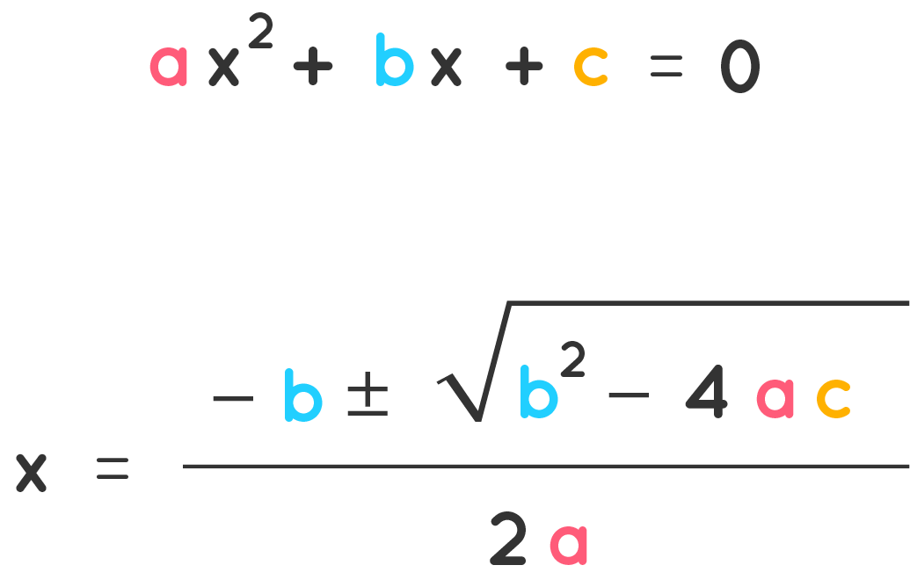
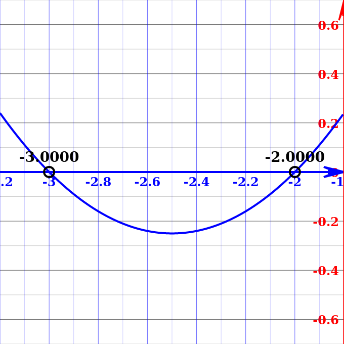

<figure markdown>
  { width="300" }
  <figcaption>Quadratic Formula</figcaption>
</figure>

## Program

    #Python program to solve the quadratic equations
    import cmath

    a = 1
    b = 5
    c = 6

    #calculate the discriminant
    w = (b**2) - (4*a*c)

    # calculate two roots
    root1 = (-b-cmath.sqrt(w))/(2*a)
    root2 = (-b+cmath.sqrt(w))/(2*a)

    print('The roots are {0} and {1}'.format(root1,root2))

## Output

    The roots are (-3+0j) and (-2+0j)
  
## Image Representation

<figure markdown>
  { width="300" }
  <figcaption>Output Image Representation</figcaption>
</figure>